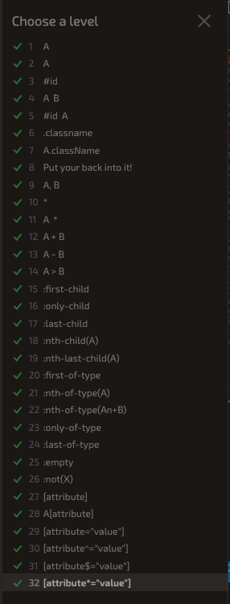

# Class 201 - 05 - Images, Color, Text - CSS Diner

### Read: Class 04: resources

[HTML: Multimedia_and_embedding](https://developer.mozilla.org/en-US/docs/Learn/HTML/Multimedia_and_embedding)

[Images_in_HTML](https://developer.mozilla.org/en-US/docs/Learn/HTML/Multimedia_and_embedding/Images_in_HTML)

[Image_types](https://developer.mozilla.org/en-US/docs/Web/Media/Formats/Image_types)

[choosing_an_image_format](https://developer.mozilla.org/en-US/docs/Web/Media/Formats/Image_types#choosing_an_image_format)

[Lear CSS](https://developer.mozilla.org/en-US/docs/Learn/CSS)

[CSS Applying_color](https://developer.mozilla.org/en-US/docs/Web/CSS/CSS_Colors/Applying_color)

[CSS Styling_text](https://developer.mozilla.org/en-US/docs/Learn/CSS/Styling_text/Fundamentals)

[7 Things To Remember When Selecting Fonts For Your Design](https://uxplanet.org/7-things-to-remember-when-selecting-fonts-for-your-design-ec1e592266c5)

[css-tricks.com](https://css-tricks.com/)

### HTML Media

1. What is a real world use case for the alt attribute being used in a website?  
Its value is supposed to be a textual description of the image, for use in situations where the image cannot be seen/displayed or takes a long time to render because of a slow internet connection.

2. How can you improve accessibility of images in an HTML document?  
Adding effective alternative text, or 'alt text', to your images increases the accessibility of your digital images.

3. Provide an example of when the figure element would be useful in an HTML document.  
It's a way to add a caption to accompany your image.  

```html
<figure>
  

  <figcaption>
    A T-Rex on display in the Manchester University Museum.
  </figcaption>
</figure>
```

4. Describe the difference between a gif image and an svg image, pretend you are explaining to an elder in your community.  

GIF: Graphics Interchange Format; It's a good choice for simple images and animations.  

SVG: Scalable Vector Graphics; It's a vector image format; ideal for user interface elements, icons, diagrams, etc., that must be drawn accurately at different sizes.

5. What image type would you use to display a screenshot on your website and why?

PNG is probably your best bet, but lossless WebP is arguably going to be better compressed.  

Unless you're willing to compromise on quality, you should use a lossless format for screenshots. Lossless WebP or PNG.

### Learn CSS

1. Describe the difference between foreground and background colors of an HTML element, pretend you are talking to someone with no technical knowledge.  

At a fundamental level, the color property defines the foreground color of an HTML element's content and the background-color property defines the element's background color. These can be used on just about any element.

2. Your friend asks you to give his colorless blog website a touch up. How would you use color to give his blog some character?  

    1. Choose a color palette: Select a set of colors that work well together and complement the content of the blog. This could involve using colors that are associated with the blog's topic or industry.

    2. Use color to highlight important content: Color can be used to draw the reader's attention to important text, such as headings or call-to-action buttons.

    3. Create a sense of hierarchy: Using a range of shades and tones of the same color can create a sense of hierarchy and help the user navigate the content.

    4. Create contrast: Using complementary colors or contrasting shades can add depth and create visual interest.

    5. Keep it consistent: Use the same color scheme throughout the website to create a cohesive look and feel.

    6. Test and iterate: It's important to test the color scheme with users and make adjustments based on feedback to ensure it enhances the user experience.

3. What should you consider when choosing fonts for an HTML document?  

    1. Branding:
    A font you select should embody the character and spirit of your brand. Try to match the font style to your brand’s character.

    2. Legibility:
    It’s evident that it’s better for a typeface to be clear and legible, rather than so unreadable. If people have to spend extra time to understand what have written, then they will disregard your design.  
    Avoid using fancy fonts or uppercase text in large bodies of text as it forces strain on the reader’s eye. It’s better to use decorative typefaces only for titles and headlines.  

    3. Serif vs Sans:
    Usually, one of the first determinations to be made when selecting a typeface for text is serif or sans?  
    While the decision can be based on several key points, one of the most important points is the length of your copy. Generally, serif typefaces are easier to read for lengthy copy than sans. Serif fonts help the eye travel across a line, especially if lines are long.
    But it’s also important to consider your target audience. Sans is preferable for young children, or anyone just learning to read. Sans is also good for readers with certain visual impairments.  

    4. Font Family:
    Some fonts are members of ‘superfamilies’ — they come along with a selection of different styles and weights that give designers more creative freedom.  
    When choosing a font for your designs, you need to know how large a font family needs to be to meet your project typographic requirements. For many projects it’s enough to have two weights with italics, while others might require additional versions to create good visual hierarchy.

    5. Limit the total number of fonts:
    Avoid using more than 2–3 fonts in your design. Each time when you think you need a new font, play with different font sizes for existing fonts.  

    6. Avoid using too similar fonts:
    The whole idea of using multiple fonts in design is creating a visual diversity. That’s why there’s no point choosing two fonts that look identical. In fact, the more similar fonts are, the more likely they will clash.  

    7. When selecting two fonts, use decisive contrast:  
    When you choose to use multiple typefaces, make sure the typefaces you’re using have substantial contrasting differences. But remember that the contrast is not the same as conflict. The ideal combination of fonts should create harmony.
    Follow a simple rule of thumb —find the two typefaces that have one thing in common but are otherwise vastly different. Combining serif with sans serif is a classic move.

4. What do font-size, font-weight, and font-style do to HTML text elements?  

- The font size is the overall size (general height) of a font shown on a screen or printed on a page.  
- The font-weight is the overall thickness of a typeface's stroke in any given font. The most common weights are regular and bold.
- The font-style allows you to make text appear italicized (i.e. sloped, or slanted). This property accepts one of three possible values: normal , italic , and oblique .

5. Describe two ways you could add spacing around the characters displayed in an h1 element.  
You can either add margin right to the first h1 tag or you can add margin left to the second h1 tag.

## Things I want to know more about

- CSS Responsive

### Labs JS

[code-201-lab5a](https://github.com/VMO2020/code-201-lab5a)

### About me

[code-201-lab5b](https://github.com/VMO2020/about-me)

### CSS Diner



### Instructor Sync

1. What are your goals while taking this course?  
Improve my knowledge to be able to build web pages professionally.

2. Are there any areas of concern, questions about the course or adjustments we might consider?  
Improve the synchronization between the course and the canva assignments.

3. What professional proficiency would you consider to be your top strength?  
I really enjoy creating new things, and especially if I use code, like creating web pages.

4. What areas of professional competency would you like to improve?  
Everything related to building better web pages.

## Reflection

> "As an adult, you have to reflect on your past experiences. This way, you can separate the bad from the good experiences and take advantage of them." "The more you learn, the more you are able to improve your life.".
> **VMOG**
