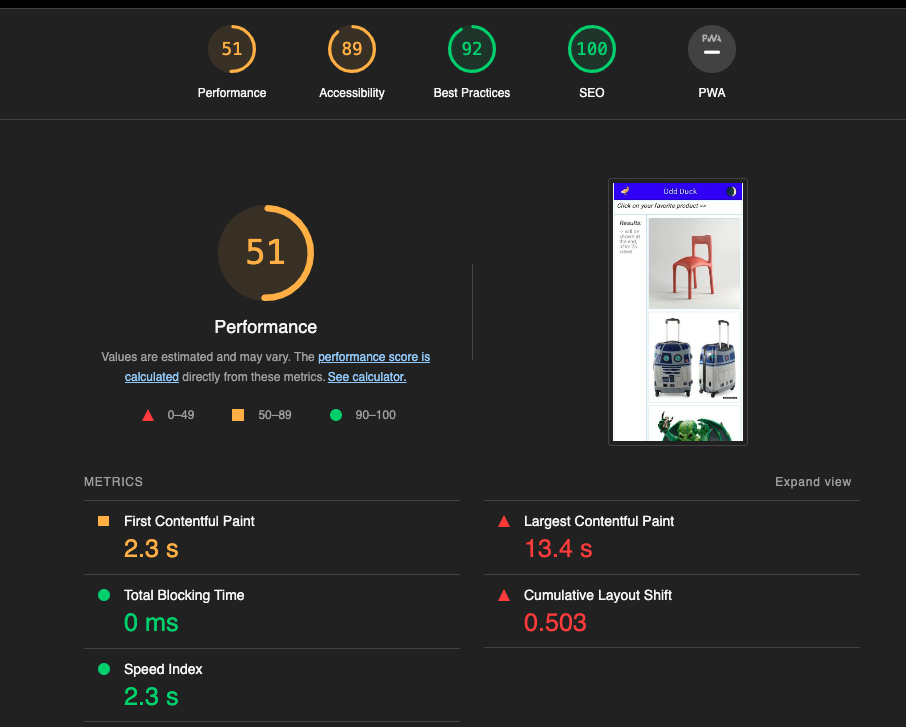
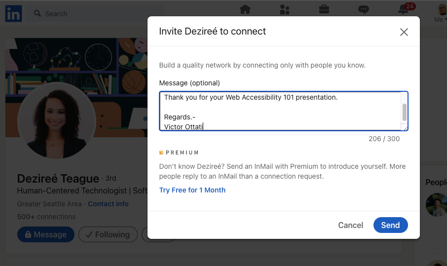

# Class 201 - 15

## Lab: Class 15a & Lab: Class 15a

[REPO](https://github.com/VMO2020/odd-duck)

[WEB](https://vmo2020.github.io/odd-duck/)

## Career: Class 15: Partner Power Hour - Report #3

[REPO](https://github.com/VMO2020/reading-notes-v2/blob/main/code-201/201class-15.md)

### Presentations

[Web Accessibility 101](https://www.youtube.com/watch?v=JW0K87kaDng)  

[CSS 101: Transitions & Animations](https://www.youtube.com/watch?v=sqc-5AFKwxM)  

[Dealing with Workplace Ambiguity](https://www.youtube.com/watch?v=mndjhcnChGI)  

### Assignment

1. Share one or two ways the speaker’s information will change your approach to your career transition.  

Knowing how to speak in public is an essential skill to succeed in your career. You must know how to present your work to other people and how to adequately explain your point of view.

2. List a few key take-aways from this presentation.  

. Connect with industry professionals.
. Gain an inside look at how the tech world operates.
. Dealing with Workplace Ambiguity

3. Share a screenshot of your LinkedIn connection request, including a nicely worded note, sent to the speaker or someone else at their company.  

## Learning Journal: 15

### Reflection

I am learning a lot from these reflections, because I have to look back on my own experiences and reflect on them. It's a good way to learn about ourselves and improve our skills.
