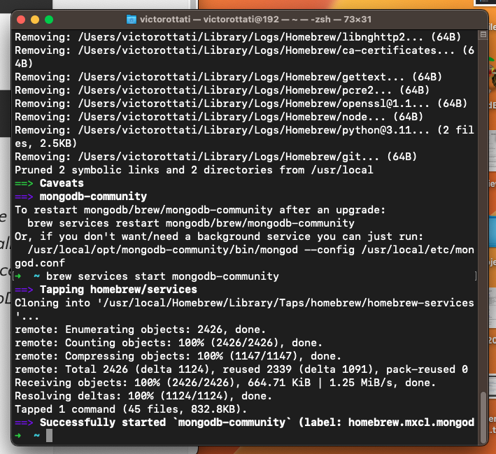

# Prework

[REPO](https://github.com/VMO2020/reading-notes-v2/blob/main/code-301/301prework.md)

## Prep: Dive Into React

[A High Level Overview Of React](https://www.youtube.com/watch?v=FRjlF74_EZk)

1. What is React?  

. React is an open-source JavaScript agnostic User Interface Library used for building user interfaces or UI components.  
. Agnostic, because React can work with many different environments.  
. In React all elements are JS Object.

2. What is a component?  React have component architecture.

In React, a component is a reusable piece of UI, consisting of JavaScript code that defines its properties, methods, and behaviors. A component can be a single element or a complex tree of nested elements.  

3. What is the dataflow of React?  

In React, the data flow is unidirectional (**one way**), from the parent component to its children. The parent component passes down data and properties to its children as props, while the children pass data back up to the parent via callbacks or events.  

4. How do we make a React element a DOM element?  

To make a React element a DOM element, we use the ReactDOM library's render method, which takes a React element and a target DOM node as arguments and renders the element into the DOM.

5. React is a User Interface **library**.  

6. Which direction does data flow in React?  

In React, data flows from parent to child components via props, and from child to parent components via callbacks or events.  

7. Every component manages its own its own **state**. State is an object that stores data that can change over time and affects the component's rendering and behavior. State can be updated by the component itself or passed down as props from its parent component.  

## Computer Setup

